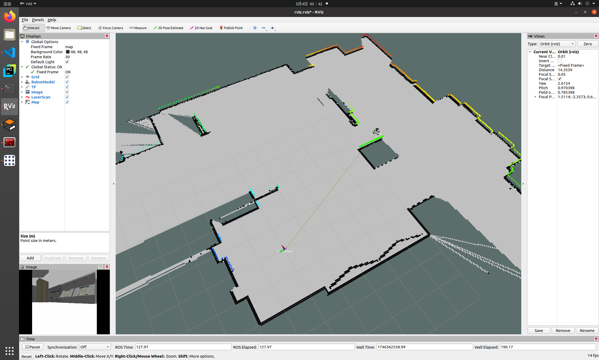
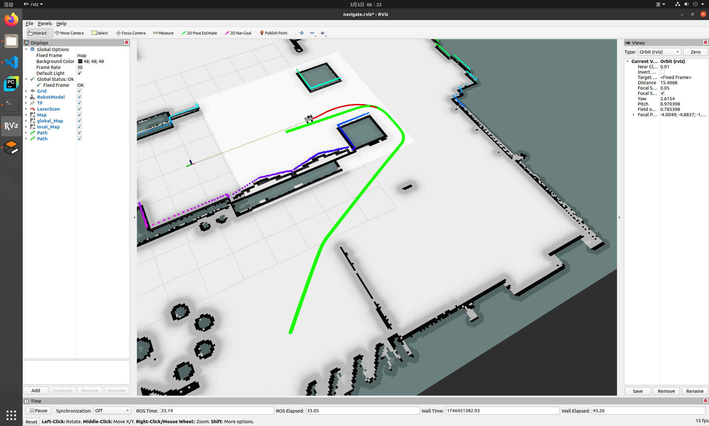
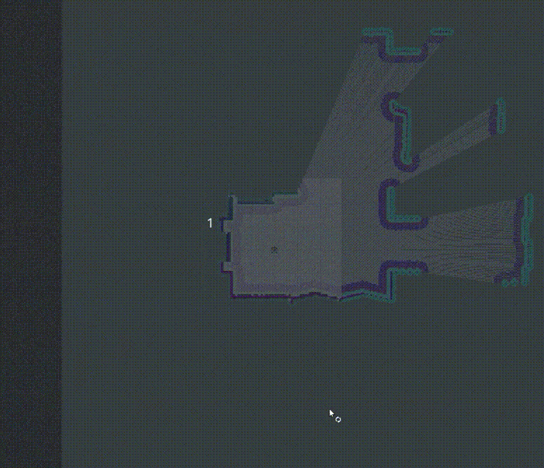
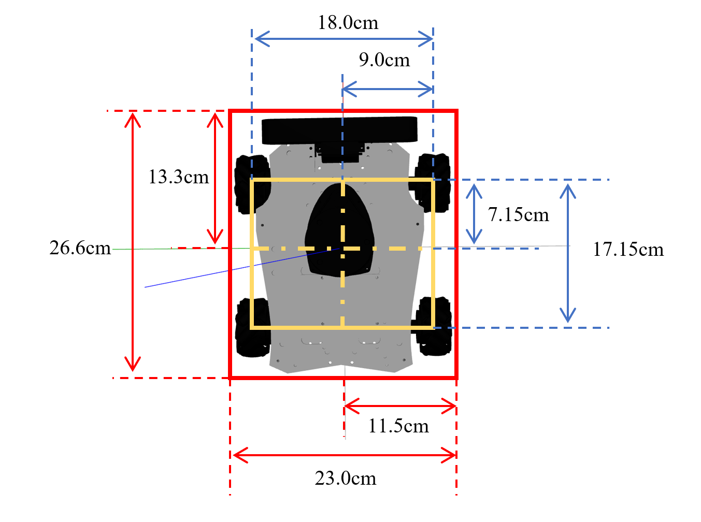

# R550_GAZEBO

<p align="center">
    
    
</p>

## Demos

| Gmapping |  |
| --- | --- |
| Navigate |  |
| Explore |  |

# How to RUN:

## Create directory
```shell
mkdir catkin_ws
cd catkin_ws
mkdir src
cd src
```

## Clone && Build
```shell
git clone https://github.com/whsleep/r550_gazebo.git
cd r550_gazebo
bash install_requirements.sh 
git submodule update --init --recursive
cd ../../
catkin_make
source ./devel/setup.bash
```

## Run

**There are three demonstrations available, and you need to choose one.**

### run Gmapping
```shell
roslaunch r550_gazebo r550_gmapping.launch
```

### run Navigate
```shell
roslaunch r550_gazebo r550_navigate.launch
```

### run Explore
```shell
roslaunch r550_gazebo r550_explore.launch
```

### Dynamic environment
```shell
roslaunch r550_gazebo r550_forRL.launch
```

# Some size information



# [TODO](https://github.com/whsleep/r550_gazebo/blob/main/question.md)
# REF

[tdle](https://github.com/SeanZsya/tdle)

[r550-ros-bot-humble](https://github.com/910514/r550-ros-bot-humble)

[nexus_4wd_mecanum_simulator](https://github.com/RBinsonB/nexus_4wd_mecanum_simulator)

[gazebo_mecanum_plugins](https://github.com/qaz9517532846/gazebo_mecanum_plugins/tree/ros1-noetic)

[m-explore](https://github.com/hrnr/m-explore)
